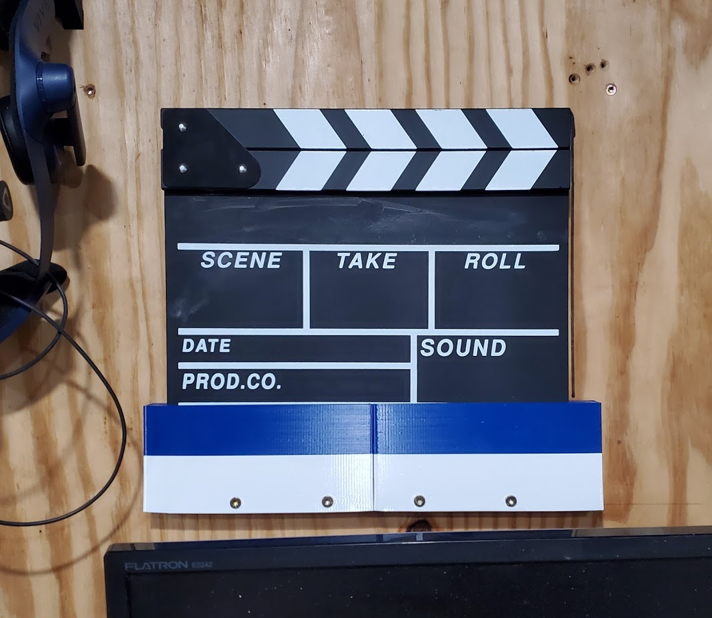

# 3dthings-clapperboard-holder
This is a openSCAD project that creates a clapperboard holder. The clapperboard
holder can be printed in either 1 or 2 pieces depending on your printer's
available build area.

The number of screws and overall dimensions are all customizable in the .scad
file.

This file is also available on thingiverse on the link below, but please
leave any comments or issues here on github. I don't check thingiverse all that
often.

https://www.thingiverse.com/thing:4669957

